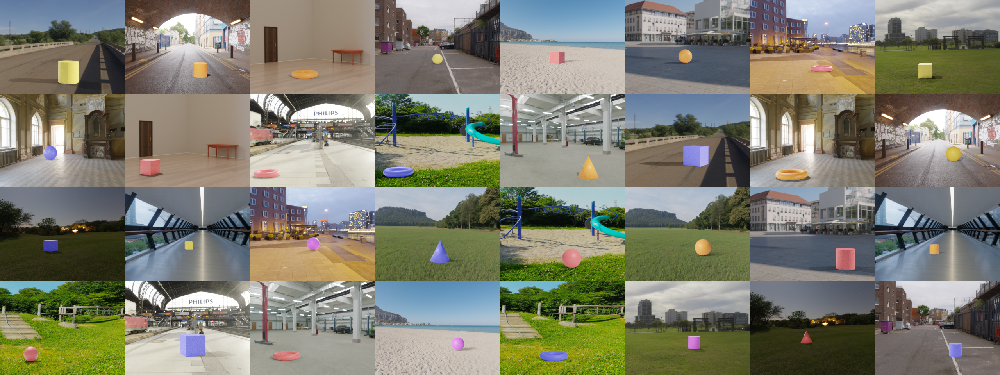
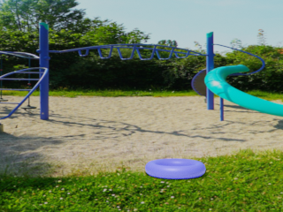

# IITH-CANDLE 

# Sample images from CANDLE

The CANDLE dataset contains 12546 images in `.png` format. Each image is rendered by randomly placing a foreground object in a background scene. Generating images in a controlled manner allows for recording the ground truth factors of variation and hence allows us to study disentangled representation learning using both unsupervised and supvervised learning.

# Factors of Variation
CANDLE dataset is generated by following the data generating mechanism detailed below. All generative factors are self explanatory. **U** denotes an unobserved confounder, viz. the subtle interactions between the *scene*'s natural light and the external *light* factor. **C** denotes any observed confounder which is responsible for spurious correlations in data. Values taken by each of the generative factors in the causal graph are listed in the table below.


| Generative Factor | Possible Values |
| --- | --- |
| Object | Cube, Sphere, Cylinder, Cone, Torus |
| Color | Red, Blue, Yellow, Purple, Orange |
| Size | Small, Medium, Large |
| Rotation | 0◦, 15◦, 30◦, 45◦, 60◦, 90◦ |
| Light | Left, Middle, Right |
| Scene | Indoor, Playground, Outdoor, Bridge, City Square, Hall, Grassland, Garage, Street, Beach, Station, Tunnel, Moonlit Grass, Dusk City, Skywalk, Garden |

# Structure of the ground-truth metadata
Ground truth information for each image in the dataset is provided in `json` format. Below is a sample image and its corresponding meta data.



```json
{
    "scene": "playground",
    "lights": "middle",
    "objects": {
        "Torus_0": {
            "object_type": "torus",
            "color": "blue",
            "size": 2.5,
            "rotation": 15,
            "bounds": [
                [150,36],
                [245,66]
            ]
        }
    }
}
```

# Downloading CANDLE
The dataset can be downloaded from [here](https://drive.google.com/drive/folders/11w267LWI8tbWhf1SR8kd-l6fP9WbJwNL) (1.7 GB).

# Simulating and extending CANDLE
CANDLE is rendered using [Blender](https://www.blender.org) by overlaying 3D sprites on panoramic HDRi background images. Simulating a version is as simple as running `blender -b -noaudio -P candle_simulator.py`.

Don't like the torus? Want a monkey there instead? Simply create the sprites and add them to the simulator. Code and instructions are at [the candle-simulator repository](https://github.com/causal-disentanglement/candle-simulator).

# Evaluation Metrics
We also propose two evaluation metrics in our paper to study *causal disentanglement*. We look at latent variable models (e.g., Beta VAE) as disentangled causal processes (Suter et al, ICML 2019) and propose two evaluation metrics to measure causal disentanglement using the notion of causally responsible generative factors in an image. Please refer to the paper for more details.

# Experiments
The code and instructions to reproduce experiments in the paper can be found at (a fork of) [disentanglement_lib](https://github.com/causal-disentanglement/disentanglement_lib).

# Abstract
Representation learners that disentangle factors of variation have already proven to be important in addressing various real world concerns such as fairness and interpretability. Initially consisting of unsupervised models with independence assumptions, more recently, weak supervision and correlated features have been explored, but without a causal view of the generative process. In contrast, we work under the regime of a causal generative process where generative factors are either independent or can be potentially confounded by a set of observed or unobserved confounders. We present an analysis of disentangled representations through the notion of disentangled causal process. We motivate the need for new metrics and datasets to study causal disentanglement and propose two evaluation metrics and a dataset. We show that our metrics capture the desiderata of disentangled causal process. Finally, we perform an empirical study on state of the art disentangled representation learners using our metrics and dataset to evaluate them from causal perspective.

# Paper PDF
AAAI version of the paper can be viewed [here](https://arxiv.org/).

An arXiv preprint is also available [here](https://arxiv.org/).

# How to cite our work
If you use *CANDLE*, please consider citing:
```
@article{candle, 
title={On Causally Disentangled Representations},  
journal={Proceedings of the AAAI Conference on Artificial Intelligence}, 
author={Abbavaram Gowtham Reddy, Benin Godfrey L, and Vineeth N Balasubramanian}, 
year={2022},
month={February}
}
```

# License
This work is licensed under the [Creative Commons Attribution 4.0 International License](https://creativecommons.org/licenses/by/4.0/).
