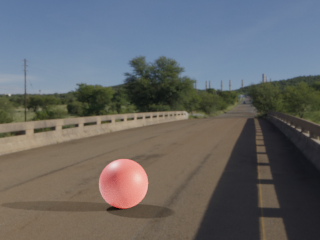

# CANDLE
An Image Dataset for Causal Analysis in Disentangled Representations
# Abstract 
Representation learners that disentangle factors of variation have already proven to be important in addressing various real world concerns such as fairness and interpretability. Initially consisting of unsupervised models with independence assumptions, more recently, weak supervision and correlated features have been explored, but without a causal view of the generative process. In contrast, we work under the regime of a causal generative process where generative factors are either independent or can be potentially confounded by a set of observed or unobserved confounders. We present an analysis of disentangled representations through the notion of disentangled causal process. We motivate the need for new metrics and datasets to study causal disentanglement and propose two evaluation metrics and a dataset. We show that our metrics capture the desiderata of disentangled causal process. Finally, we perform an empirical study on state of the art disentangled representation learners using our metrics and dataset to evaluate them from causal perspective.
# Sample images from CANDLE

The code used to simulate the dataset can be found at [the candle-simulator repository](https://github.com/causal-disentanglement/candle-simulator).

# Downloading the dataset
The dataset can be downloaded from [here](https://drive.google.com/drive/folders/11w267LWI8tbWhf1SR8kd-l6fP9WbJwNL) (1.7 GB).

# Factors of Variation
CANDLE dataset is generated by following the following data generation mechanism. All generative factors are self explanatory. **U** is unobserved confounder indicating the subtle interactions between scene's natural light and the external *light* factor. **C** is observed confounder which is responsible for spurious correlations in data. Values taken by each of the generative factors in the causal graph are listed in the table below.


| Generative Values | Factor |
| --- | --- |
| Object | Cube, Sphere, Cylinder, Cone, Torus |
| Color | Red, Blue, Yellow, Purple, Orange |
| Size | Small, Medium, Large |
| Rotation | 0◦, 15◦, 30◦, 45◦, 60◦, 90◦ |
Light | Left, Middle, Right |
| Scene | Indoor, Playground, Outdoor, Bridge, City Square, Hall,Grassland, Garage, Street, Beach, Station, Tunnel, Moonlit Grass, Dusk City, Skywalk, Garden |

# Structure of the ground-truth metadata
The dataset contains 12546 `png` images. Corresponding ground truth information is provided in `json` format as shown below.


```json
{   
    "scene": "bridge",
    "lights": "left",
    "objects": {
        "Sphere_0": {
            "object_type": "sphere",
            "color": "red",
            "size": 2,
            "rotation": 60,
            "bounds": [
                [95, 29], [154, 87]
            ]
        }
    }
}
```
# Code
The code and instructions to reproduce experiments in the paper can be found [here](https://github.com/causal-disentanglement/disentanglement_lib) 
# How to cite our work
If you use *CANDLE*, please consider citing:
```
To be updated after uploading paper to arxiv
```
# License
This work is licensed under the [Creative Commons Attribution 4.0 International License](https://creativecommons.org/licenses/by/4.0/).
